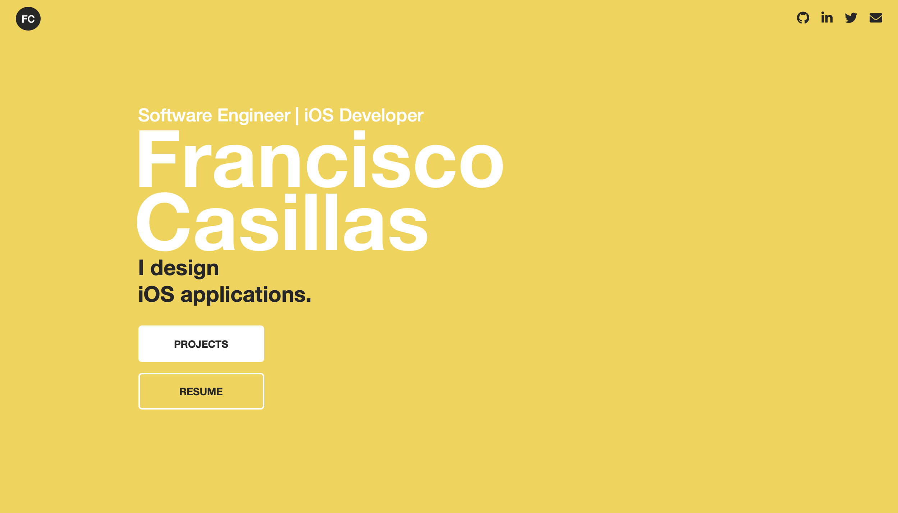

# Portfolio
I designed my own portfolio to showcase my design and iOS development abilities in one single place. I also decided to craft my own webpage in order to include all the features I personally required, nothing more and nothing less, as well as show a bit of my own personality. 

👉 [Live website]([https://franciscoxcode.github.io/portfolio/index.html](https://franciscoxcode.github.io/portfolio-v1/index.html))

## Screenshots

## How It's Made
**Tech used:** HTML, CSS, Javascript

## Features
* Metro design
* Responsive website for all screen sizes
* Visitors can book a meeting with me through the contact form immediately
* Access to my projects, cv and social media links on every single page

## Optimizations
- [ ] Finish resume
- [ ] Responsive resume (only for webpage)
- [ ] A4 resume can be downloaded or printed with a click of a button
- [ ] Image size optimization for faster loading
- [ ] About me section at the bottom of the front page
- [ ] Carousel of project's images

### Lessons Learned:
1. **Do your research.** The first problem I encountered when faced with this project was figuring out what should a good portfolio contain. And since I didn't know the answer, I had to make an extensive research on the Internet. I guess the easiest thing I could have done was just to look for an article that enumerated all the stuff required inside a portfolio page. But instead, I looked at maybe a hundred people's portfolios just to find out what elements caught my eye. In an exercise that could resemble the philosophy of Austing Kleon's book, [Steal Like An Artist](https://www.amazon.com/Steal-Like-Artist-Things-Creative/dp/0761169253), I picked and chose the best bits I caught from other people's pages, to finally put them together inside my own portfolio site. 
2. **Be practical.** Sometimes I have a hard time deciding whether someone else's ideas and opinions are better than mine. See, I was struggling with the idea of adding an 'about me' section inside my portfolio. I mean, I have a summary inside my resume, which is inside my portfolio, and a big 'about me' section on [my LinkedIn page](https://www.linkedin.com/in/chiccasillas/). Why would I want ANOTHER about me section here? Well, people insisted I should have one just to give a clearer picture of myself as a professional to visitors, even if the design, the layout, the fonts and the colors did that with fewer words. So I had a hard time making up my mind. That is until someone mentioned SEO. See, having an 'about me' section would improve the searchability of my site, and THAT is something I do want. So I gave in, I decided on being practical over being a minimalist. 

## Design

**Design tools used:** Figma, Affinity Designer

For this project I only required Figma to build the wireframes and Affinity Designer to edit my icons and change their colors. Aside from that, I had to choose the ideal color palette and fonts to convey my message and personality. 

### Fonts

### Color Palette

